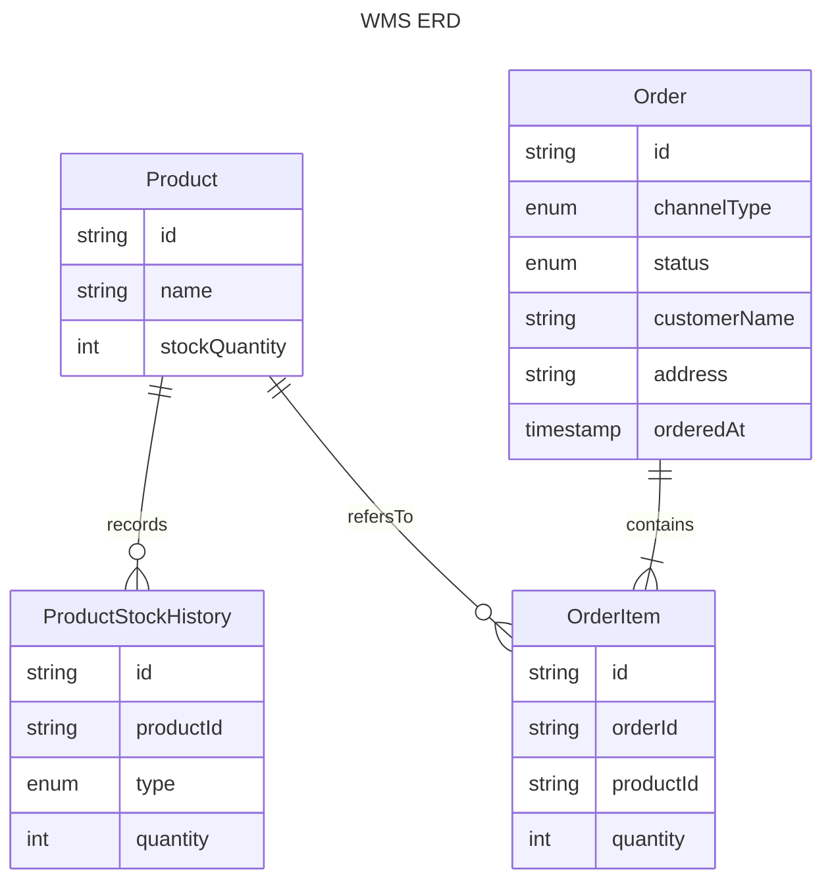
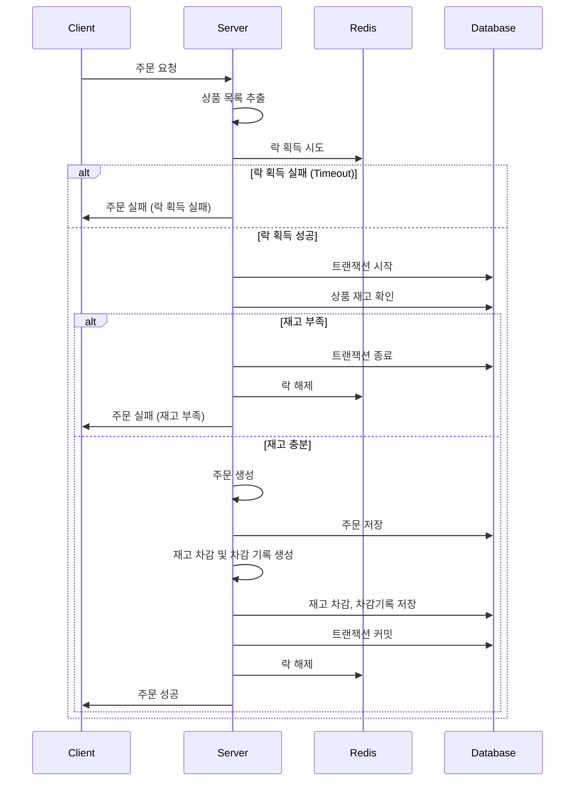

# WMS

## 1. ERD

```mermaid
---
title: WMS ERD
---
erDiagram
    Product {
        string id
        string name
        int stockQuantity
    }
  ProductStockHistory {
        string id
        string productId
        enum type
        int quantity
    }
    Order {
        string id
        enum channelType
        enum status
        string customerName
        string address
        timestamp orderedAt
    }
    OrderItem {
        string id
        string orderId
        string productId
        int quantity
    }
    
    Product ||--o{ ProductStockHistory : records
    Order ||--|{ OrderItem : contains
    Product ||--o{ OrderItem : refersTo
%% ERD Image : https://www.mermaidchart.com/raw/36c177c6-d6ca-4bd9-ace2-1d369c2ea766?theme=dark&version=v0.1&format=svg  
```

## 2. Sequence Diagram

### 2.1 단건 주문 등록

```mermaid
sequenceDiagram
  participant C as Client
  participant S as Server
  participant R as Redis
  participant D as Database
  
  C ->> S: 주문 요청
  S ->> S: 상품 목록 추출
  S ->> R: 락 획득 시도
  alt 락 획득 실패 (Timeout)
    S ->> C: 주문 실패 (락 획득 실패)
  else 락 획득 성공
    S ->> D: 트랜잭션 시작
    S ->> D: 상품 재고 확인
    alt 재고 부족
      S ->> D: 트랜잭션 종료
      S ->> R: 락 해제
      S ->> C: 주문 실패 (재고 부족)
    else 재고 충분
      S ->> S: 주문 생성
      S ->> D: 주문 저장
      S ->> S: 재고 차감 및 차감 기록 생성
      S ->> D: 재고 차감, 차감기록 저장
      S ->> D: 트랜잭션 커밋
      S ->> R: 락 해제
      S ->> C: 주문 성공
    end
  end
```
