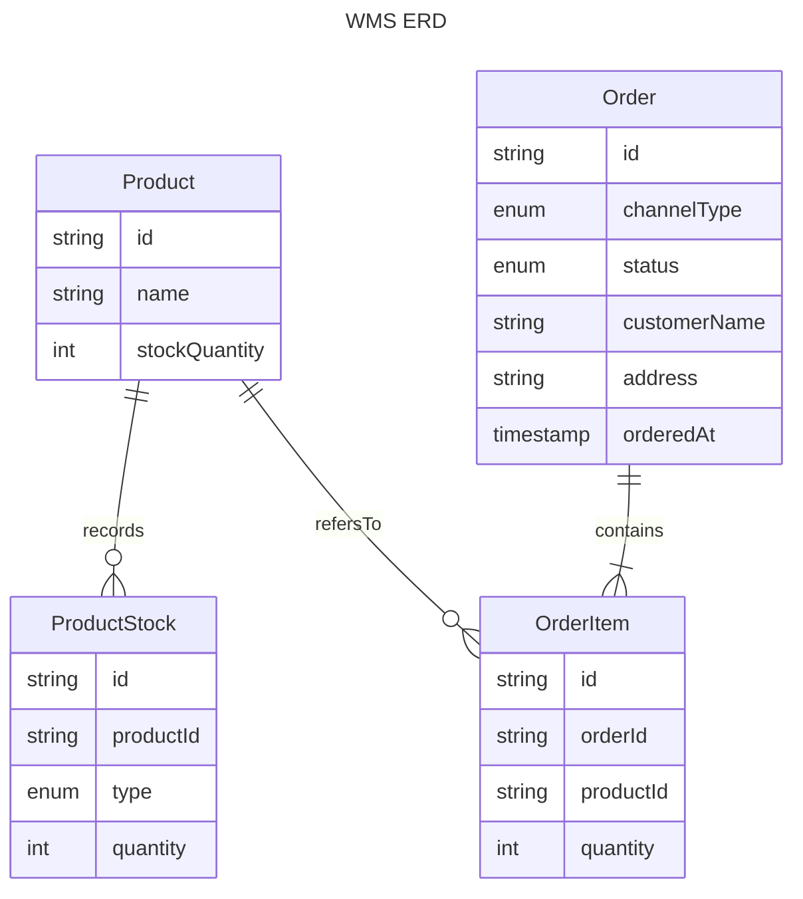
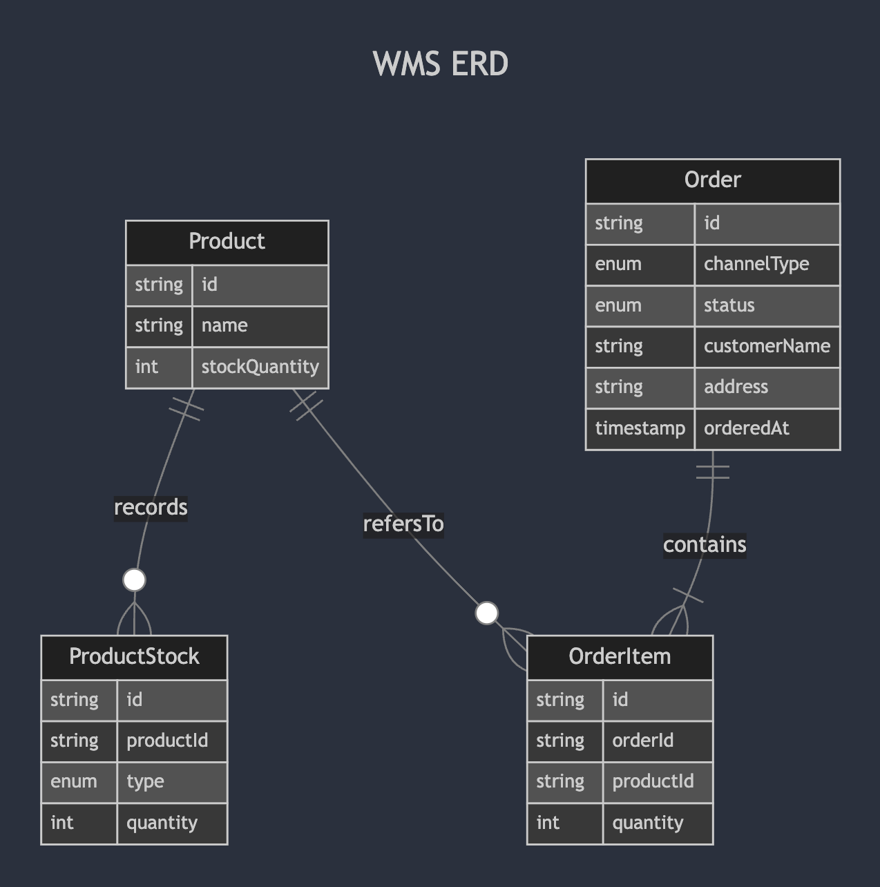

# WMS

```mermaid
---
title: WMS ERD
---
erDiagram
    Product {
        string id
        string name
        int stockQuantity
    }
    ProductStock {
        string id
        string productId
        enum type
        int quantity
    }
    Order {
        string id
        enum channelType
        enum status
        string customerName
        string address
        timestamp orderedAt
    }
    OrderItem {
        string id
        string orderId
        string productId
        int quantity
    }
    
    Product ||--o{ ProductStock : records
    Order ||--|{ OrderItem : contains
    Product ||--o{ OrderItem : refersTo
```

