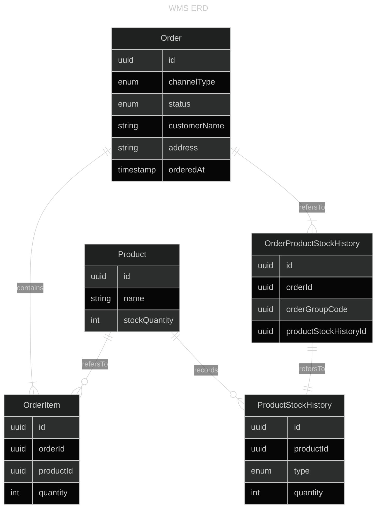
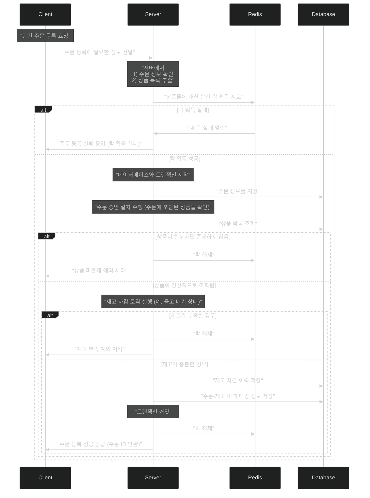
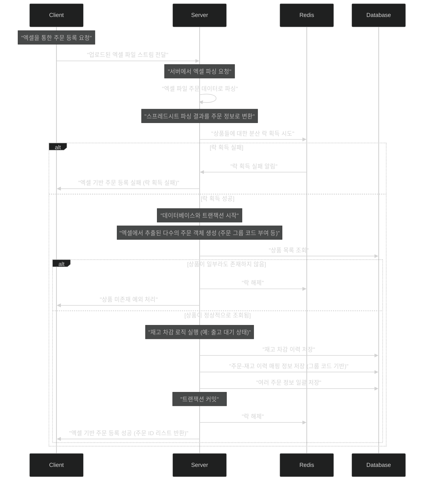

# WMS

실행방법(별도의 profile 혹은 환경 설정이 필요하지 않습니다.)

```shell
./gradlew bootRun
```

## 1. 애플리케이션 아키텍처

- presentation : Client 와 상호작용을 담당
    - Controller, GlobalExceptionHandling 등
- application : 비즈니스 로직 처리를 담당
- domain : 핵심 비즈니스 로직 & 데이터 모델링을 담당
- infra : 외부 시스템 & 외부 의존성과의 연동을 담당
    - DB, Redis
    - Excel Parsing Library

## 2. ERD



## 3. Sequence Diagram

### 3.1 단건 주문 등록



### 3.2 Excel 주문 등록



## 4. 프로젝트 상세 설명

### 4.1 사용된 라이브러리 및 오픈소스

`org.projectlombok:lombok`
- 목적 : Getter, Constructor 등의 보일러 코드 자동 생성을 통해 생산성 향상 도모

`com.github.codemonstur:embedded-redis`
- 목적 : 서버에 Redis 서버를 내장하여 로컬 환경 구축하기 위함 
  - Docker 를 통한 Redis 서버 구축도 고려했으나, 과제 실행 편의성을 위해 내장 Redis 로 결정
  - 내장 Redis 오픈소스 중에서는 `ozimov/embedded-redis` 가 가장 유명하지만, 오랜 기간 업데이트가 없어 `codemonstur/embedded-redis` 사용

`org.apache.poi:poi`
- 목적 : 엑셀 파일 파싱
  - 이미 오랜기간 검증된 라이브러리이고 xls, xlsx 등 다양한 엑셀 파일 형식을 안정적으로 지원함

### 4.2 기능 구현시 고려한 사항

**1. 엑셀 주문 등록시 'All or Nothing' vs 'Partial Success' 중 어떤 방식으로 처리**
> 엑셀 주문 등록시에 100건 중 1건만 실패해도 모든 주문이 롤백되어야 하는지, 아니면 일부 주문만 성공하고 일부는 실패해도 되는지에 대한 고민이 있었습니다.
>   - 'All or Nothing' 방식을 선택한 이유
>     - 주문 성공은 실제 재고 차감과 연관된 행위이기 때문에, 최대한 보수적으로 접근해야할 것이라 생각해서, 'All or Nothing' 방식을 선택했습니다.
>     - 그리고 UX 측면에서도, 사용자가 엑셀 주문 등록시에는 모든 주문이 성공해야한다고 생각했습니다.
>     - 만약, 'Partial Success' 방식을 선택한다면, 사용자는 엑셀 주문 등록시에 주문 성공 여부를 확인하기 어려울 것이라 생각했습니다.
    
**2. 엑셀 주문 등록시의 상품 재고 차감 로직**

> 엑셀 주문 등록시에는 많은 주문이 동시에 처리되어야하는데, 한 상품에 대한 여러 주문이 섞여있을 수 있다고 생각했습니다.
> 그래서 상품 재고 차감을 각 주문별로 처리하지 않고, 엑셀에 작성된 상품의 차감 횟수를 합하여 한번에 처리하는 방식을 선택했습니다.

**3. UUID 사용**

> 팀프레시 WMS 는 많은 주문량과 물량을 다루는 분산시스템으로 구성되어있다고 알고있습니다.
> 그래서 sequential 한 ID 대신 UUID 를 식별자로 사용하여, 분산환경에도 안전한 식별자를 사용할 수 있도록 구성했습니다.

**4. '상품 재고 이력' & '주문 상품 이력'의 분리(단방향 참조 지향)**

> 먼저 '상품'의 재고 정보는 각 '상품'이 가지되, 그 이력을 추적할 수 있도록 '상품 재고 이력' 을 정의했습니다.
> 그리고 '주문'이 발생했을 때, 차감된 '상품 재고 이력'을 추적할 수 있어야 한다고 생각했습니다.
> 사실 '상품 재고 이력' 이 '주문 ID' 를 갖는 방식이 가장 직관적이고 쉬운 방법이지만, 최종적으로 이 방법은 선택하지 않았습니다.
> 
> 제가 설계 & 구현시에 가장 신경쓰는것은 참조 방향을 단방향으로 만드는 것이고, 유지보수 관점에서 굉장히 중요하다고 생각합니다.
> 그런 관점에서, '상품' <- '주문' 의 단방향 관계를 만들기 위해 고민했고, '주문 상품 재고 이력' 을 별도로 정의했습니다.
> 
> 그리고 단방향의 참조 방향은 패키지 구조 측면에서도 적용되었는데요.
> presentation -> application -> domain, infra 방향으로 참조하도록 구성했고, 역방향으로 참조되는 코드는 존재하지 않습니다.
> (개인적으로 코드들의 import 구문을 보면서, 잘못된 참조가 없는지 습관적으로 점검하는 편입니다.)

5. infra 영역에서는 최대한 interface 만 노출시키는 방향으로 구현

> infra 영역은 외부 시스템 & 의존성의 구현체가 존재하는 영역입니다.
> 그래서 외부 시스템이 변경되더라도, 이를 사용하는 애플리케이션이 최대한 영향을 받지 않도록 interface 만 노출시키는 방향으로 구현했습니다.
